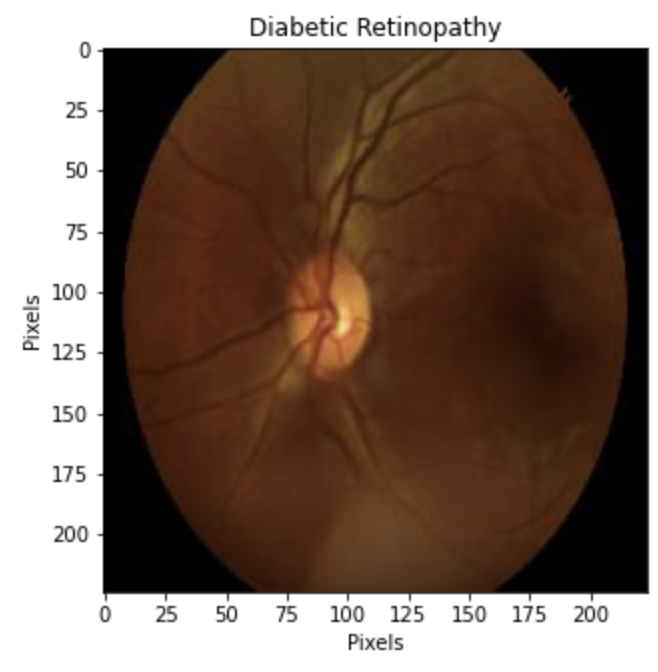
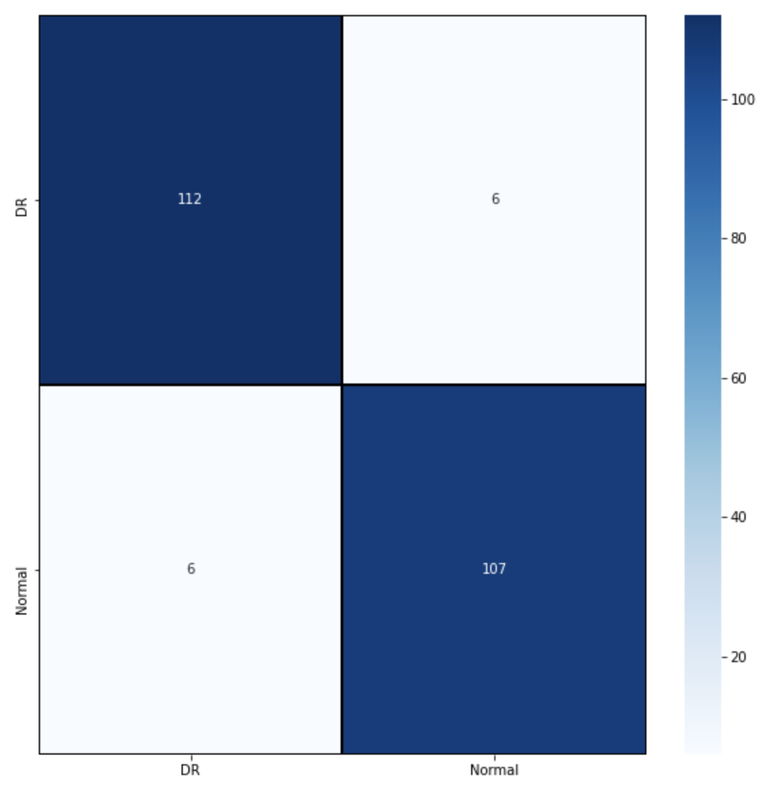
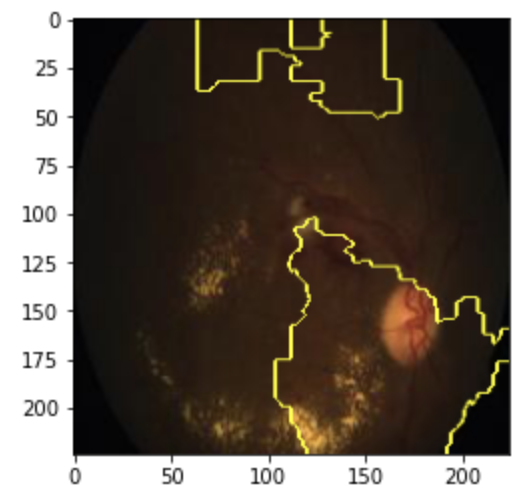

# Diabetic Retinopathy Analysis

**Author**: [Michael Tsypin](email:mtsypin9@yahoo.com)

Date: 6/14/2024

## Overview

Diabetic retinopathy (DR) is the leading cause of vision loss in the world. The use of early detection and treatment of DR is imperative in preventing vision loss. However, the current method of DR identification is time consuming and erroneous as it requires manual labor which can potentially lead to incorrect diagnosis of DR. This project aims to create a model that can predict whether a patient has diabetic retinopathy or not based on a retinal image.

## Business Problem

An Opthalmology unit of a hospital wants to make more accurate diagnoses and reduce the amount of time spent reviewing retinal images for diabetic retinopathy. We need to create a model that is able to read and analyze retinal images to determine if a patient has diabetic retinopathy. Using the diabetic retinopathy dataset, this model will be effective in producing mass results and accurate readings in a timely manner.

## Data Understanding

This data comes from Kaggle and is provided by user Parisa Karimi Darabi. The dataset used in this project contains many retinal images captured through various imaging procedures, such as color fundus photos and optical coherence tomography. A medical professional assessed the diagnosis of each retinal image and classified each image as having diabetic retinopathy or not.

Data link: https://www.kaggle.com/datasets/pkdarabi/diagnosis-of-diabetic-retinopathy/data

See the full dataset in [diabetic_retinopathy](diabetic_retinopathy) 


## Modeling

Utilizing and iterating through deep neural networks to find the model with highest recall score.




## Evaluation

VGG19 model is the best model with a recall score of 95%



Here we have a confusion matrix which tells us the amount of True Positives (top left corner), False Positives (bottom left corner), False Negatives (top right corner), and True Negatives (bottom right corner). False negatives are the most detrimental of the four. A false negative in this scenario is when our model predicts the image to be normal, when in reality, there is diabetic retinopathy. This is extremely harmful to the patient as this misdiagnosis can potentially lead to vision loss as diabetic retinopathy was not identified and therefore not treated. Our model has only identified 6 false negatives.



We can use LIME to help us interpret the model's results. LIME (Local Interpretable Model-agnostic Explanations) is used as an explanation of the model in how it reads and digests the image to make its decision. In the image above, we can see that the model is looking at the part of the image within the yellow outline to show us where the model sees diabetic retinopathy within the eye and therefore classifies the image as having diabetic retinopathy. LIME is also helpful to us as it can be used help an opthalmologist make a diagnosis faster by viewing the outlined part of the retinal image and help make a diagnosis.

## Conclusion

The best and final model we found based on recall score was our VGG19 model. This model has a recall score of 95%. We would recommend that the hospital use this model to feed retinal images so that an opthamologist can use the model's prediction to help determine a diagnosis of diabetic retinopathy or not. We would also recommend that the opthamologist use LIME to aid diagnosis assistance by making more accurate and quicker diagnoses using LIME outlines.

## For More Information

See the full analysis in the [Jupyter Notebook](diabetic_retinopathy_analysis.ipynb) or review [Presentation](diabetic_retinopathy_presentation.pdf)

## Repository Structure

```
├── diabetic_retinopathy
├── images
├── .gitignore
├── README.md
├── diabetic_retinopathy_analysis
└── diabetic_retinopathy_presentation
```
