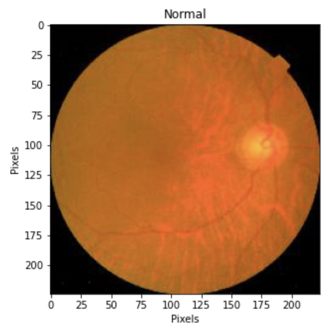

# Diabetic Retinopathy Analysis

**Author**: [Michael Tsypin](email:mtsypin9@yahoo.com)

Date: 6/14/2024

## Overview

Diabetic retinopathy (DR) is the leading cause of vision loss in the world. The use of early detection and treatment of DR is imperative in preventing vision loss. However, the current method of DR identification is time consuming and erroneous as it requires manual labor which can potentially lead to incorrect diagnosis of DR. This project aims to create a model that can predict whether a patient has diabetic retinopathy or not based on a retinal image.

## Business Problem

An Opthalmology unit of a hospital wants to make more accurate diagnoses and reduce the amount of time spent reviewing retinal images for diabetic retinopathy. We need to create a model that is able to read and analyze retinal images to determine if a patient has diabetic retinopathy. Using the diabetic retinopathy dataset, this model will be effective in producing mass results and accurate readings in a timely manner.

## Data Understanding

This data comes from Kaggle and is provided by user Parisa Karimi Darabi. The dataset used in this project contains many retinal images captured through various imaging procedures, such as color fundus photos and optical coherence tomography. A medical professional assessed the diagnosis of each retinal image and classified each image as having diabetic retinopathy or not.

Data link: https://www.kaggle.com/datasets/pkdarabi/diagnosis-of-diabetic-retinopathy/data

See the full dataset in [diabetic_retinopathy](diabetic_retinopathy) 

## Modeling
Utilizing and iterating through deep neural networks to find the model with highest recall score.

## Evaluation
